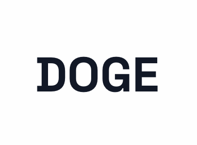

<div align="center">

# DOGE (Decentralized Organization Governance Engine)



[](https://opensource.org/licenses/MIT)
[](https://www.typescriptlang.org/)
[](https://nextjs.org/)
[](https://docs.soliditylang.org/)
[](https://flow.com/)

A revolutionary decentralized governance platform for organizational budget management and decision-making.

[Explore Demo](https://doge-demo.vercel.app) · [Report Bug](https://github.com/yourusername/doge/issues) · [Request Feature](https://github.com/yourusername/doge/issues)

</div>

---

## 🌟 Why DOGE?

DOGE revolutionizes organizational governance by combining the power of blockchain technology with intuitive department management. Our platform enables:

- **Transparent Budget Management**: Real-time tracking of department budgets
- **Decentralized Decision Making**: Democratic proposal and voting system
- **Automated Execution**: Smart contract-powered budget allocation
- **Comprehensive Activity Tracking**: Full audit trail of all operations

## 🚀 Core Features

### Department Management

- Create and manage department structures
- Assign department heads with specific privileges
- Track department performance metrics

### Budget Control System

- Real-time budget tracking
- Smart contract-powered fund allocation
- Automated budget execution
- Multi-signature transaction approval

### DAO Governance

- Create and vote on budget proposals
- Weighted voting system
- Automated proposal execution
- Governance token (DOGE) integration

### Activity Monitoring

- Real-time activity dashboard
- Transaction history
- Department performance analytics
- Audit trails

## 🛠 Technical Architecture

### Frontend

- **Framework**: Next.js 14 with App Router
- **Styling**: TailwindCSS + shadcn/ui
- **State Management**: React Context + Hooks
- **Web3 Integration**: ethers.js + Flow Client Library

### Backend

- **Smart Contracts**: Solidity 0.8.24
- **Blockchain**: Flow + EVM Compatible
- **File Storage**: Cloudinary CDN

### Authentication

- **Web3 Auth**: Privy Integration
- **Role Management**: Smart Contract-based

## 📦 Installation

### Prerequisites

```bash
Node.js >= 18.0.0
PostgreSQL >= 14
MetaMask Wallet
Flow CLI (optional)
```

### Environment Variables

Create `.env.local`:

```bash
# Blockchain
NEXT_PUBLIC_DEPARTMENT_REGISTRY_ADDRESS=<contract_address>
WALLET_PRIVATE_KEY_FLOW=<private_key>

# Authentication
NEXT_PUBLIC_PRIVY_APP_ID=<privy_app_id>

# Storage
CLOUDINARY_API_SECRET=<cloudinary_secret>

# AI Integration
NEXT_PUBLIC_AI_ENDPOINT=<ai_endpoint>
NEXT_PUBLIC_AI_CREDENTIALS=<credentials>

# Database
DATABASE_URL=<postgresql_url>
```

### Setup Steps

1. **Clone Repository**

```bash
git clone https://github.com/pakariisbum0/AegisGuard.git
cd AegisGuard
```

2. **Install Dependencies**

```bash
npm install
# or
yarn install
```

3. **Start Development Server**

```bash
npm run dev
```

4. **Smart Contract Deployment**

```bash
npx hardhat compile
npx hardhat run scripts/deploy.js --network flow
```

## 🧪 Testing

### Smart Contract Tests

```bash
npx hardhat test
```

### Frontend Tests

```bash
npm run test
# or
yarn test
```

## 🚢 Deployment

### Smart Contracts

1. Configure networks in `hardhat.config.js`
2. Deploy to testnet:

```bash
npx hardhat run scripts/deploy.js --network flowTestnet
```

3. Deploy to mainnet:

```bash
npx hardhat run scripts/deploy.js --network flowMainnet
```

### Frontend

1. Build the application:

```bash
npm run build
```

2. Deploy to Vercel:

```bash
vercel deploy
```

## 🤝 Contributing

We welcome contributions! Please follow these steps:

1. Fork the repository
2. Create your feature branch (`git checkout -b feature/AmazingFeature`)
3. Commit your changes (`git commit -m 'Add some AmazingFeature'`)
4. Push to the branch (`git push origin feature/AmazingFeature`)
5. Open a Pull Request

## 📜 License

Distributed under the MIT License. See `LICENSE` for more information.

## 👥 Team

- **Developer** - [@leaddev](https://github.com/pakariisbum0)

## 🙏 Acknowledgments

- Huge thanks to ETHGlobal for the opportunity to build this project.

<div align="center">
Made with ❤️ by the DOGE Team
</div>
